<div align="center">


# Run &amp; Eat

**Urban Gastronomic Events Platform**

[](https://www.php.net/)
[](https://www.mysql.com/)
[](#)
[](#)
[](#)
[](#)

*DAW · Stucom Barcelona · 2026*

---

*[Read this in Spanish / Leer en Español](#español)*

</div>

## Table of Contents

- [Description](#-description)
- [Tech Stack](#-tech-stack)
- [Project Structure](#-project-structure)
- [Features](#-features)
- [User Roles](#-user-roles)
- [Database](#-database)
- [Local Installation](#-local-installation)
- [Security](#-security)
- [Team](#-team)

---

## Description

**Run & Eat** is a web platform specialized in publishing and managing urban gastronomic events. It connects culinary experience organizers with participants looking to discover local gastronomy in an active and social way: fun runs, wine tastings, burger runs, tapas routes, and much more.

The project was developed entirely as an academic project for the **Web Application Development (DAW)** course at Stucom, Barcelona, using standard web technologies without external frameworks.

| Feature | Detail |
|---|---|
| Type | Event web platform |
| Main City | Barcelona, Spain |
| Roles | Client · Organizer |
| Authentication | Native PHP Sessions |
| No external dependencies | Native PHP + MySQL |

---

## Tech Stack

| Layer | Technology |
|---|---|
| Backend | PHP 8.0+ (native, no frameworks) |
| Database | MySQL 8.0 — MySQLi with prepared statements |
| Frontend | HTML5 + CSS3 + JavaScript ES6 |
| Server | Apache (XAMPP recommended for local) |
| Version Control | Git |
| File Uploads | PHP `finfo` + `move_uploaded_file()` |

---

## Project Structure

```
run-and-eat/
│
├── index.php                    # Event listing (main page / entry point)
│
├── controller/                  # Business logic and authentication
│   ├── EventController.php      # Event management logic
│   ├── UserController.php       # User management logic
│   └── auth_guard.php           # Authentication and roles middleware
│
├── view/                        # HTML views and PHP view controllers
│   ├── login.php / login.html   # Login form and logic
│   ├── registro.php / .html     # Registration form and logic
│   ├── perfil.php / .html       # User profile management
│   ├── crear-evento.php / .html # Event creation
│   ├── edit-event.php           # Event editing
│   ├── evento.php / .html       # Event detail with map
│   ├── logout.php               # Session destruction
│   ├── contacto.html
│   ├── faq.html
│   ├── about-us.html
│   ├── Ignacio.html
│   └── Gorka.html
│
├── database/                    # Database connection and SQL scripts
│
├── public/                      # Public static assets
│   ├── style/                   # CSS stylesheets
│   ├── scripts/                 # Global JavaScript
│   ├── img/                     # Images and user profile photos
│   ├── fonts/                   # Custom fonts
│   └── svg/                     # Vector icons
│
├── Actividades/                 # Academic activity files
├── Diagrams/                    # Diagrams and planning models
└── TestUnitario/                # Unit tests
```

---

## Features

### Authentication

| Action | Description | File |
|---|---|---|
| Register | Field validation, email format, password matching, user type, and DB duplicates | `UserController.php` |
| Login | Credential check against DB and session writing | `UserController.php` |
| Logout | Full session destruction with `session_unset()` + `session_destroy()` | `UserController.php` |
| Guard | Middleware that protects routes by role; redirects to forbidden if not authorized | `auth_guard.php` |

### User Profile

| Action | Description |
|---|---|
| Edit info | Update name and email with validation for duplicated email in another account |
| Change password | Current password verification before applying changes; minimum 8 characters |
| Profile photo | Upload with real MIME validation (`finfo`), allowed extension, and 2 MB limit |
| My events | List of registered events using `JOIN` with the `INSCRIPCIONES` table |

### Events

| Action | Role | Description |
|---|---|---|
| List events | All | Main page with pagination and city search |
| View detail | All | Full info, integrated Google Maps map, registration button |
| Create event | Organizer | Form with image, level, cuisine type, price, capacity, and distance |
| Register | Client | Requires active session; redirects to login if unauthenticated |

### User Interface

The platform prioritizes a smooth and interactive user experience. **Both events and organizers are displayed using a dynamic carousel managed by the jQuery Slick plugin**. This implementation significantly improves navigation, allowing touch sliding on mobile and visual controls on desktop, optimizing the visual presentation of content.

#### Color Palette
The visual identity of **Run & Eat** uses an elegant dark mode with vibrant accents:

- 🟠 `#FFA208` — **Vibrant Orange**: Main accent color (buttons, links, stars, icons).
- 🌑 `#0A192F` — **Deep Navy Blue**: Main background color.
- 🌒 `#112240` — **Light Navy Blue**: Background color for cards, headers, and menus.
- ⚪ `#FFFFFF` — **White**: Main text.
- 🔘 `#233554` — **Grayish Blue**: Borders, dividers, and secondary elements.

---

## Sequence Diagrams

Below are the main interaction flows of the application to better understand the communication between the client, the server, and the database.

### 1. Event Management

#### View Event Detail (Read)
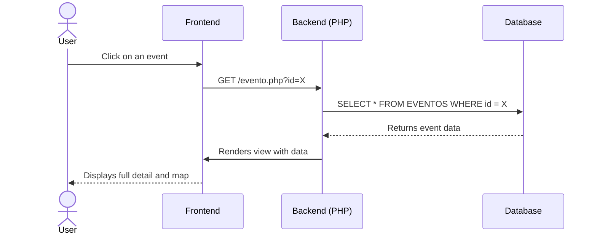

#### Create Event
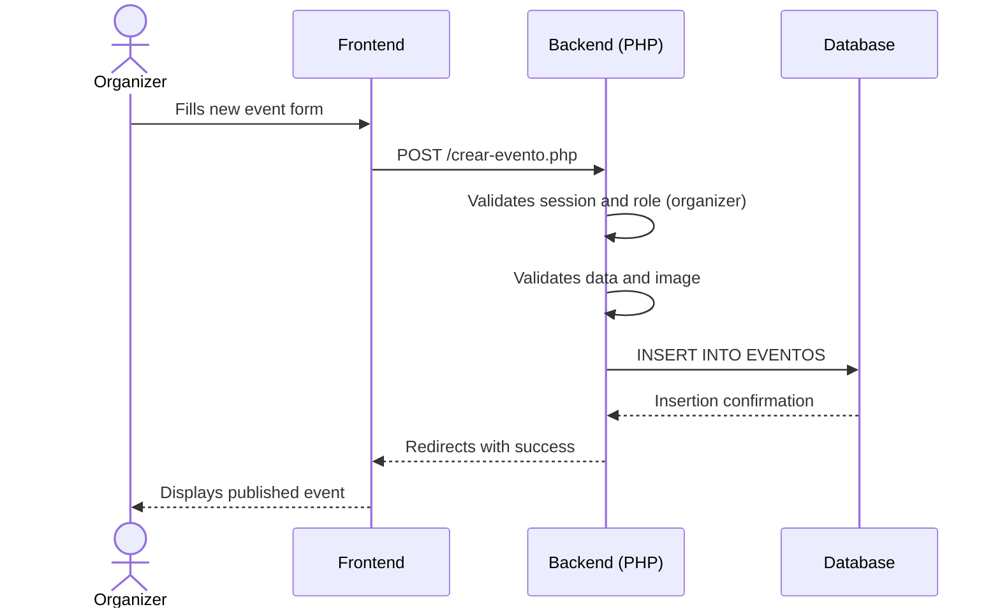

#### Modify Event
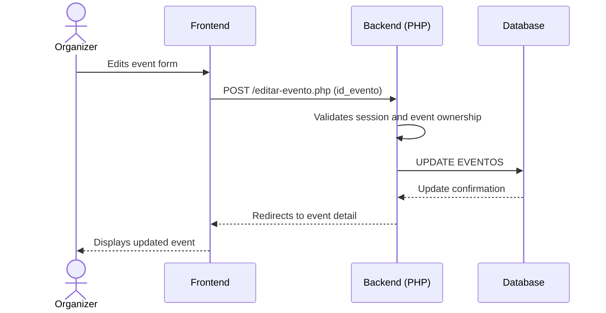

#### Delete Event
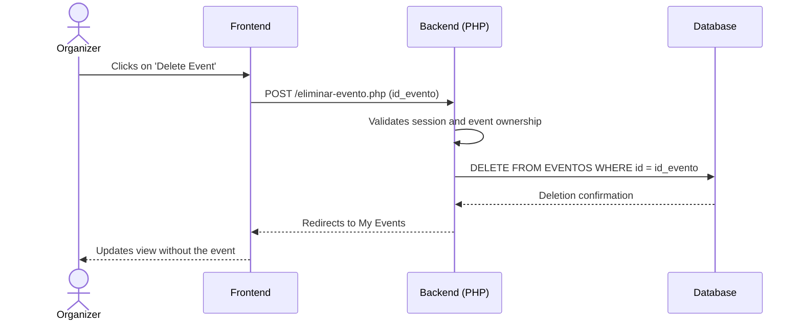

### 2. User Management

#### Modify Profile
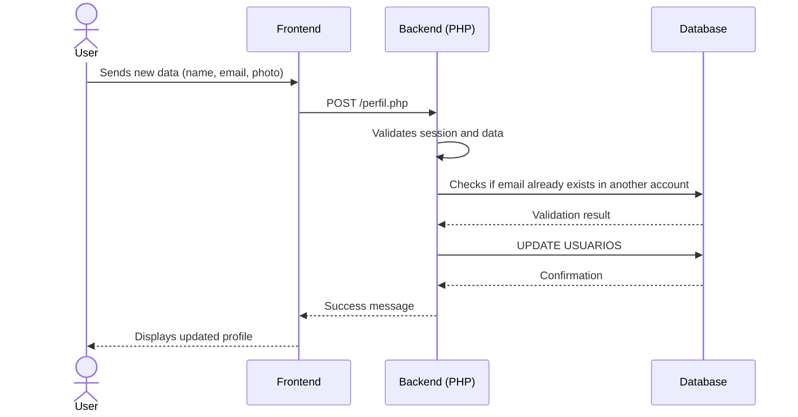

#### Change Password
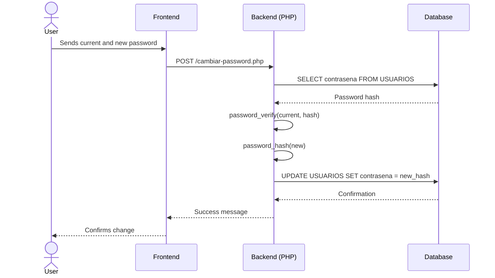

#### Delete User
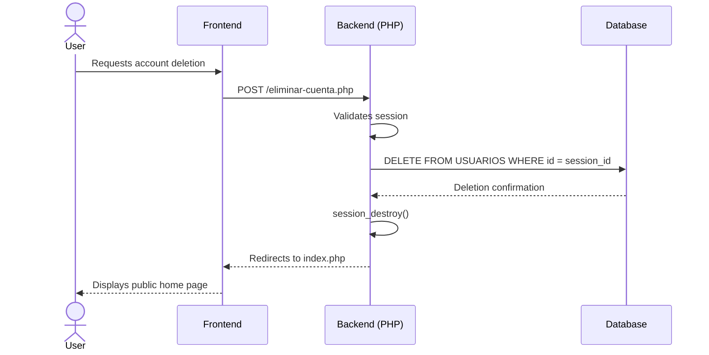

---

## User Roles

Access to different sections is managed through `auth_guard.php` using three main functions:

```php
auth_require_login();           // Requires active session
auth_require_role("organizador"); // Requires specific role
auth_is("organizador");         // Returns bool — conditional use in views
auth_check();                   // Checks if there is an active session
```

| Permission | `client` | `organizer` |
|---|---|---|
| View event listing | ✅ | ✅ |
| View event detail | ✅ | ✅ |
| Register for event | ✅ | ✅ |
| Manage profile | ✅ | ✅ |
| Create events | ❌ | ✅ |
| "Create event" button in nav | ❌ | ✅ |

If a user with a `client` role tries to access a route protected by `organizer`, `auth_guard.php` renders a **restricted access** page instead of redirecting, showing the user's name and a link to the contact form.

---

## Database

**Name:** `mp0487_run_eat`  
**Engine:** MySQL 8.0  
**Charset:** UTF-8

### Tables

| Table | Description | Key Fields |
|---|---|---|
| `USUARIOS` | Registry of all users | `id_usuario`, `nombre_completo`, `email`, `contrasena`, `tipo_usuario`, `foto_perfil`, `fecha_registro`, `activo` |
| `EVENTOS` | Events published by organizers | `id_evento`, `id_organizador`, `titulo`, `descripcion`, `fecha`, `hora`, `ciudad`, `direccion`, `precio`, `participantes`, `nivel`, `tipo` |
| `INSCRIPCIONES` | N:M relationship between users and events | `id_usuario`, `id_evento` |
| `VALORACIONES` | User reviews on attended events | `id_valoracion`, `id_usuario`, `id_evento`, `puntuacion`, `comentario` |
| `FAVORITOS` | Events saved by users | `id_usuario`, `id_evento` |

### Connection

```php
$conexion = mysqli_connect("localhost", "root", "", "mp0487_run_eat");
mysqli_set_charset($conexion, "utf8");
```

> The default configuration uses the `root` user with no password, suitable for a local environment with XAMPP. It must be changed in production.

---

## Local Installation

### Prerequisites

- PHP 8.0 or higher
- MySQL 8.0
- Apache — **XAMPP** is recommended
- Git

### Steps

```bash
# 1. Clone the repository
git clone https://github.com/usuario/RunAndEat_ProyectoTransaversal_DAW1
cd run-and-eat
```

```bash
# 2. Copy the folder to the Apache directory
# XAMPP on Windows:  C:\xampp\htdocs\run-and-eat
# XAMPP on Linux:    /opt/lampp/htdocs/run-and-eat
# Apache on Linux:   /var/www/html/run-and-eat
```

```bash
# 3. Import the database from phpMyAdmin
#    → Create a DB named "mp0487_run_eat"
#    → Import the .sql file included in the project
```

```bash
# 4. Start Apache and MySQL from the XAMPP panel
#    or with systemctl on Linux:
sudo systemctl start apache2
sudo systemctl start mysql
```

```bash
# 5. Access from the browser
http://localhost/RunAndEat_ProyectoTransaversal_DAW1/index.php
```

### Write Permissions

The profile photos folder must have write permissions for the web server:

```bash
chmod 755 public/img/user-photos/
# or on Windows: ensure Apache has write access to that folder
```

---

## Security

| Measure | Status | Detail |
|---|---|---|
| Prepared statements | ✅ Implemented | All queries use `mysqli_prepare()` — protection against SQL Injection |
| HTML output escaping | ✅ Implemented | `htmlspecialchars()` on all user data outputs |
| Session control | ✅ Implemented | Middleware `auth_guard.php` with role control on each protected route |
| Upload validation | ✅ Implemented | Real MIME verification with `finfo`, extension, and 2 MB limit |
| Password hashing | ✅ Implemented | Passwords protected using `password_hash()` with PHP's default algorithm |
| CSRF Protection | ⚠️ Partial | No CSRF tokens in forms — recommended to add them in production |
| HTTPS | ⚠️ Local environment | Not configured — mandatory before any deployment to production |

> **Security Note:** Passwords are encrypted securely using `password_hash()` and verified using `password_verify()`, maintaining backward compatibility with old plain-text accounts for a smooth transition.

---

## Team

<div align="center">

| | Name | Role | Responsibilities |
|---|---|---|---|
| 👤 | **Ignacio Breñas** | Co-CEO · Co-Founder | MySQL DB Architecture, PHP backend business logic, stored procedures |
| 👤 | **Gorka Ramírez** | Co-CEO · Co-Founder | Development of all views, user experience, layout, and interface design |

</div>

**Individual Stack:**

- **Ignacio** — HTML · CSS · MySQL · PHP · Backend · Git
- **Gorka** — HTML · CSS · JavaScript · Frontend · Git · Brand Image·

---

<div align="center">


**Run & Eat** · Stucom Pelai · DAW 1 · 2026

*Academic project — all rights reserved*

</div>

<br><br>
<hr>
<br><br>

<div align="center" id="español">


# Run &amp; Eat

**Plataforma de eventos gastronómicos urbanos**

[](https://www.php.net/)
[](https://www.mysql.com/)
[](#)
[](#)
[](#)
[](#)

*DAW · Stucom Barcelona · 2026*

---

</div>

## Índice

- [Descripción](#-descripción)
- [Stack tecnológico](#-stack-tecnológico)
- [Estructura del proyecto](#-estructura-del-proyecto)
- [Funcionalidades](#-funcionalidades)
- [Roles de usuario](#-roles-de-usuario)
- [Base de datos](#-base-de-datos)
- [Instalación local](#-instalación-local)
- [Seguridad](#-seguridad)
- [Equipo](#-equipo)

---

## Descripción

**Run & Eat** es una plataforma web especializada en la publicación y gestión de eventos gastronómicos urbanos. Conecta a organizadores de experiencias culinarias con participantes que buscan descubrir la gastronomía local de una forma activa y social: carreras populares, catas de vino, burger runs, rutas de tapas y mucho más.

El proyecto fue desarrollado íntegramente como trabajo académico del ciclo de **Desarrollo de Aplicaciones Web (DAW)** en Stucom, Barcelona, usando tecnologías web estándar sin frameworks externos.

| Característica | Detalle |
|---|---|
| Tipo | Plataforma web de eventos |
| Ciudad principal | Barcelona, España |
| Roles | Cliente · Organizador |
| Autenticación | Sesiones PHP nativas |
| Sin dependencias externas | PHP nativo + MySQL |

---

## Stack tecnológico

| Capa | Tecnología |
|---|---|
| Backend | PHP 8.0+ (nativo, sin frameworks) |
| Base de datos | MySQL 8.0 — MySQLi con prepared statements |
| Frontend | HTML5 + CSS3 + JavaScript ES6 |
| Servidor | Apache (XAMPP recomendado para local) |
| Control de versiones | Git |
| Subida de archivos | PHP `finfo` + `move_uploaded_file()` |

---

## Estructura del proyecto

```
run-and-eat/
│
├── index.php                    # Listado de eventos (página principal)
│
├── controller/                  # Lógica de negocio y autenticación
│   ├── EventController.php      # Lógica de gestión de eventos
│   ├── UserController.php       # Lógica de gestión de usuarios
│   └── auth_guard.php           # Middleware de autenticación y roles
│
├── view/                        # Vistas HTML y controladores de vista PHP
│   ├── login.php / login.html   # Formulario y lógica de login
│   ├── registro.php / .html     # Formulario y lógica de registro
│   ├── perfil.php / .html       # Gestión del perfil de usuario
│   ├── crear-evento.php / .html # Creación de eventos
│   ├── edit-event.php           # Edición de eventos
│   ├── evento.php / .html       # Detalle de evento con mapa
│   ├── logout.php               # Destrucción de sesión
│   ├── contacto.html
│   ├── faq.html
│   ├── about-us.html
│   ├── Ignacio.html
│   └── Gorka.html
│
├── database/                    # Conexión a base de datos y scripts SQL
│
├── public/                      # Assets estáticos públicos
│   ├── style/                   # Hojas de estilo CSS
│   ├── scripts/                 # JavaScript global
│   ├── img/                     # Imágenes y fotos de perfil
│   ├── fonts/                   # Fuentes tipográficas
│   └── svg/                     # Iconos vectoriales
│
├── Actividades/                 # Archivos de actividades académicas
├── Diagrams/                    # Diagramas y modelos de planificación
└── TestUnitario/                # Pruebas unitarias
```

---

## Funcionalidades

### Autenticación

| Acción | Descripción | Archivo |
|---|---|---|
| Registro | Validación de campos, formato de email, coincidencia de contraseñas, tipo de usuario y duplicados en BD | `UserController.php` |
| Login | Comprobación de credenciales contra BD y escritura de sesión | `UserController.php` |
| Logout | Destrucción completa de sesión con `session_unset()` + `session_destroy()` | `UserController.php` |
| Guard | Middleware que protege rutas por rol; redirige a forbidden si no autorizado | `auth_guard.php` |

### Perfil de usuario

| Acción | Descripción |
|---|---|
| Editar información | Actualización de nombre y email con validación de email duplicado en otra cuenta |
| Cambiar contraseña | Verificación de contraseña actual antes de aplicar cambios; mínimo 8 caracteres |
| Foto de perfil | Subida con validación de MIME real (`finfo`), extensión permitida y límite de 2 MB |
| Mis eventos | Listado de eventos inscritos mediante `JOIN` con la tabla `INSCRIPCIONES` |

### Eventos

| Acción | Rol | Descripción |
|---|---|---|
| Listar eventos | Todos | Página principal con paginación y buscador por ciudad |
| Ver detalle | Todos | Información completa, mapa de Google Maps integrado, botón de inscripción |
| Crear evento | Organizador | Formulario con imagen, nivel, tipo de cocina, precio, aforo y distancia |
| Inscripción | Cliente | Requiere sesión activa; redirige al login si no está autenticado |

### Interfaz de Usuario

La plataforma prioriza una experiencia de usuario fluida e interactiva. **Tanto los eventos como los organizadores se muestran mediante un carrusel dinámico gestionado por el plugin Slick de jQuery**. Esta implementación mejora significativamente la navegación, permitiendo deslizar de forma táctil en móviles y usar controles visuales en escritorio, optimizando la presentación visual del contenido.

#### Paleta de Colores
La identidad visual de **Run & Eat** utiliza un modo oscuro elegante con acentos vibrantes:

- 🟠 `#FFA208` — **Naranja Vibrante**: Color principal de acento (botones, enlaces, estrellas, iconos).
- 🌑 `#0A192F` — **Azul Marino Profundo**: Color de fondo principal.
- 🌒 `#112240` — **Azul Marino Claro**: Color de fondo para tarjetas (cards), cabeceras y menús.
- ⚪ `#FFFFFF` — **Blanco**: Texto principal.
- 🔘 `#233554` — **Azul Grisáceo**: Bordes, separadores y elementos secundarios.

---

## Diagramas de Secuencia

A continuación se detallan los flujos de interacción principales de la aplicación para comprender mejor la comunicación entre el cliente, el servidor y la base de datos.

### 1. Gestión de Eventos

#### Ver Detalle de Evento (Leer)
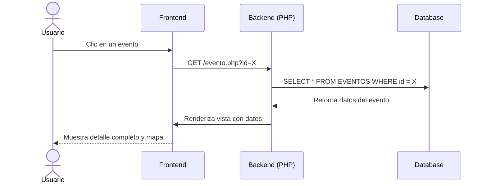

#### Crear Evento
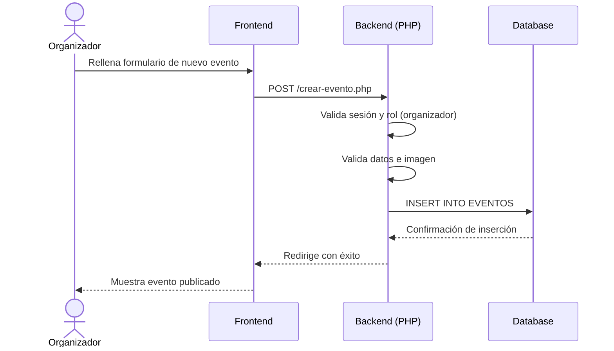

#### Modificar Evento
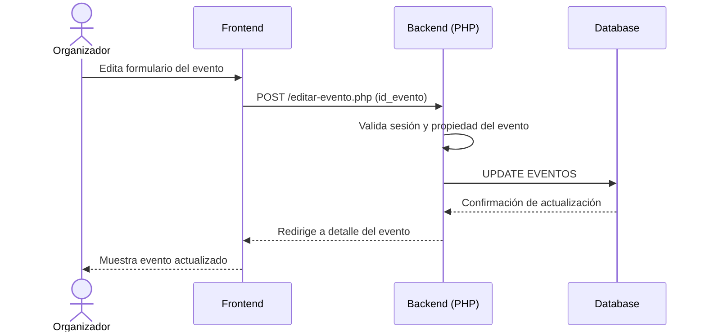

#### Eliminar Evento
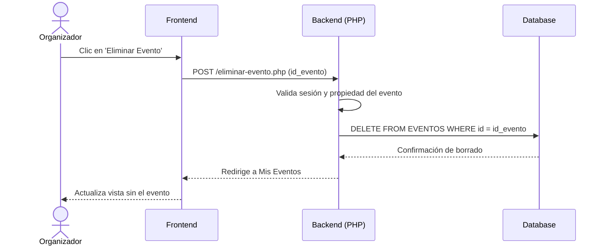

### 2. Gestión de Usuarios

#### Modificar Perfil
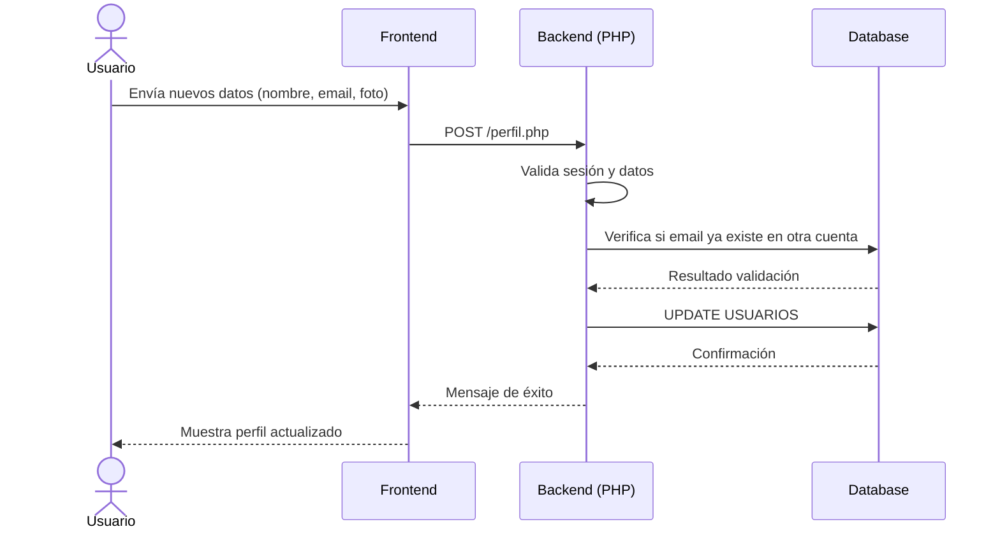

#### Cambiar Contraseña
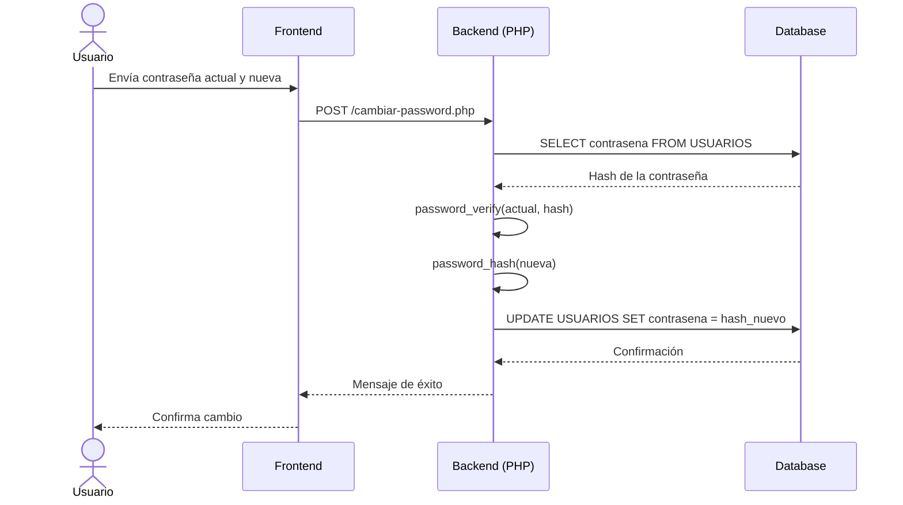

#### Eliminar Usuario
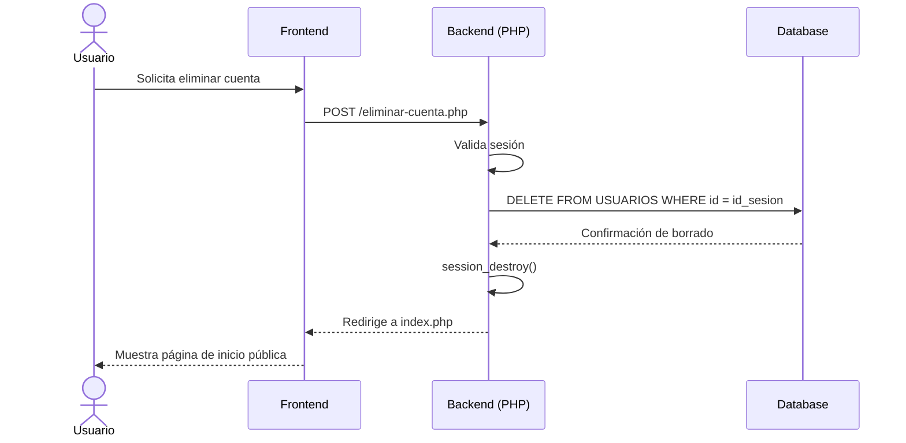

---

## Roles de usuario

El acceso a las diferentes secciones se gestiona a través de `auth_guard.php` mediante tres funciones principales:

```php
auth_require_login();           // Requiere sesión activa
auth_require_role("organizador"); // Requiere rol específico
auth_is("organizador");         // Devuelve bool — uso condicional en vistas
auth_check();                   // Comprueba si hay sesión activa
```

| Permiso | `cliente` | `organizador` |
|---|---|---|
| Ver listado de eventos | ✅ | ✅ |
| Ver detalle de evento | ✅ | ✅ |
| Inscribirse en evento | ✅ | ✅ |
| Gestionar perfil | ✅ | ✅ |
| Crear eventos | ❌ | ✅ |
| Botón "Crear evento" en nav | ❌ | ✅ |

Si un usuario con rol `cliente` intenta acceder a una ruta protegida por `organizador`, `auth_guard.php` renderiza una página de **acceso restringido** en lugar de redirigir, mostrando el nombre del usuario y un enlace al formulario de contacto.

---

## Base de datos

**Nombre:** `mp0487_run_eat`  
**Motor:** MySQL 8.0  
**Charset:** UTF-8

### Tablas

| Tabla | Descripción | Campos clave |
|---|---|---|
| `USUARIOS` | Registro de todos los usuarios | `id_usuario`, `nombre_completo`, `email`, `contrasena`, `tipo_usuario`, `foto_perfil`, `fecha_registro`, `activo` |
| `EVENTOS` | Eventos publicados por organizadores | `id_evento`, `id_organizador`, `titulo`, `descripcion`, `fecha`, `hora`, `ciudad`, `direccion`, `precio`, `participantes`, `nivel`, `tipo` |
| `INSCRIPCIONES` | Relación N:M entre usuarios y eventos | `id_usuario`, `id_evento` |
| `VALORACIONES` | Reseñas de usuarios sobre eventos asistidos | `id_valoracion`, `id_usuario`, `id_evento`, `puntuacion`, `comentario` |
| `FAVORITOS` | Eventos guardados por usuarios | `id_usuario`, `id_evento` |

### Conexión

```php
$conexion = mysqli_connect("localhost", "root", "", "mp0487_run_eat");
mysqli_set_charset($conexion, "utf8");
```

> La configuración por defecto usa usuario `root` sin contraseña, adecuada para entorno local con XAMPP. En producción debe cambiarse.

---

## Instalación local

### Requisitos previos

- PHP 8.0 o superior
- MySQL 8.0
- Apache — se recomienda **XAMPP**
- Git

### Pasos

```bash
# 1. Clona el repositorio
git clone https://github.com/usuario/RunAndEat_ProyectoTransaversal_DAW1
cd run-and-eat
```

```bash
# 2. Copia la carpeta al directorio de Apache
# XAMPP en Windows:  C:\xampp\htdocs\run-and-eat
# XAMPP en Linux:    /opt/lampp/htdocs/run-and-eat
# Apache en Linux:   /var/www/html/run-and-eat
```

```bash
# 3. Importa la base de datos desde phpMyAdmin
#    → Crea una BD llamada "mp0487_run_eat"
#    → Importa el archivo .sql incluido en el proyecto
```

```bash
# 4. Arranca Apache y MySQL desde el panel de XAMPP
#    o con systemctl en Linux:
sudo systemctl start apache2
sudo systemctl start mysql
```

```bash
# 5. Accede desde el navegador
http://localhost/RunAndEat_ProyectoTransaversal_DAW1/index.php
```

### Permisos de escritura

La carpeta de fotos de perfil debe tener permisos de escritura para el servidor web:

```bash
chmod 755 public/img/user-photos/
# o en Windows: asegúrate de que Apache tiene acceso de escritura a esa carpeta
```

---

## Seguridad

| Medida | Estado | Detalle |
|---|---|---|
| Prepared statements | ✅ Implementado | Todas las consultas usan `mysqli_prepare()` — protección contra SQL Injection |
| Escape de salida HTML | ✅ Implementado | `htmlspecialchars()` en todos los outputs de datos de usuario |
| Control de sesión | ✅ Implementado | Middleware `auth_guard.php` con control por rol en cada ruta protegida |
| Validación de subidas | ✅ Implementado | Verificación de MIME real con `finfo`, extensión y límite de 2 MB |
| Hash de contraseñas | ✅ Implementado | Contraseñas protegidas mediante `password_hash()` con el algoritmo por defecto de PHP |
| Protección CSRF | ⚠️ Parcial | No hay tokens CSRF en los formularios — recomendable añadirlos en producción |
| HTTPS | ⚠️ Entorno local | No configurado — obligatorio antes de cualquier despliegue en producción |

> **Nota de seguridad:** Las contraseñas se encriptan de forma segura utilizando `password_hash()` y se verifican mediante `password_verify()`, manteniendo compatibilidad retrospectiva con cuentas antiguas en texto plano para una transición fluida.

---

## Equipo

<div align="center">

| | Nombre | Rol | Responsabilidades |
|---|---|---|---|
| 👤 | **Ignacio Breñas** | Co-CEO · Co-Fundador | Arquitectura de BD MySQL, lógica de negocio backend en PHP, procedimientos almacenados |
| 👤 | **Gorka Ramírez** | Co-CEO · Co-Fundador | Desarrollo de todas las vistas, experiencia de usuario, maquetación y diseño de interfaz |

</div>

**Stack individual:**

- **Ignacio** — HTML · CSS · MySQL · PHP · Backend · Git
- **Gorka** — HTML · CSS · JavaScript · Frontend · Git · Imagen de marca·

---

<div align="center">


**Run & Eat** · Stucom Pelai · DAW 1 · 2026

*Proyecto académico — todos los derechos reservados*

</div>