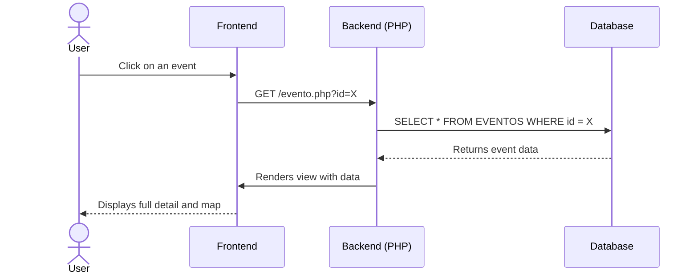
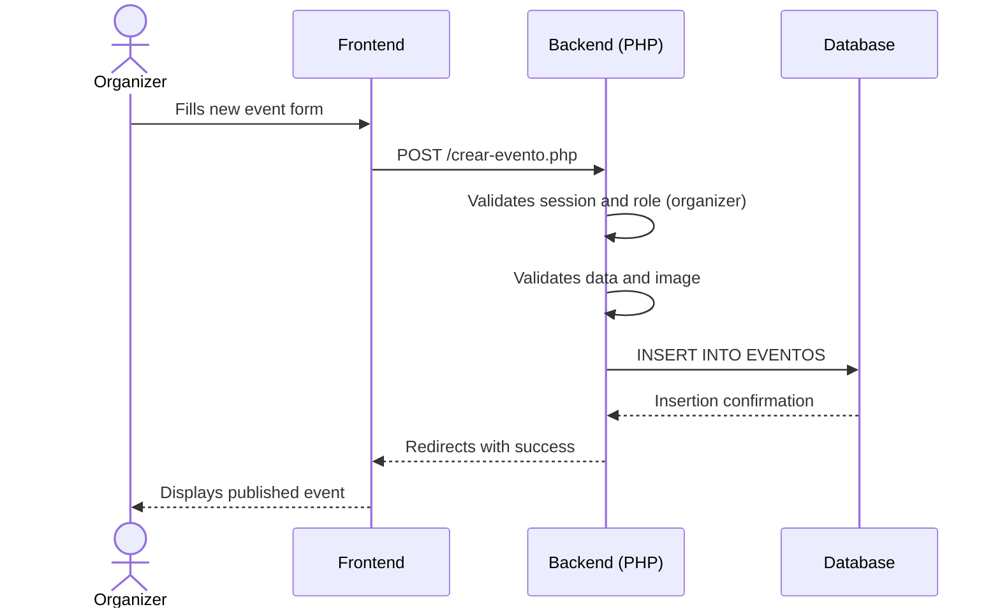
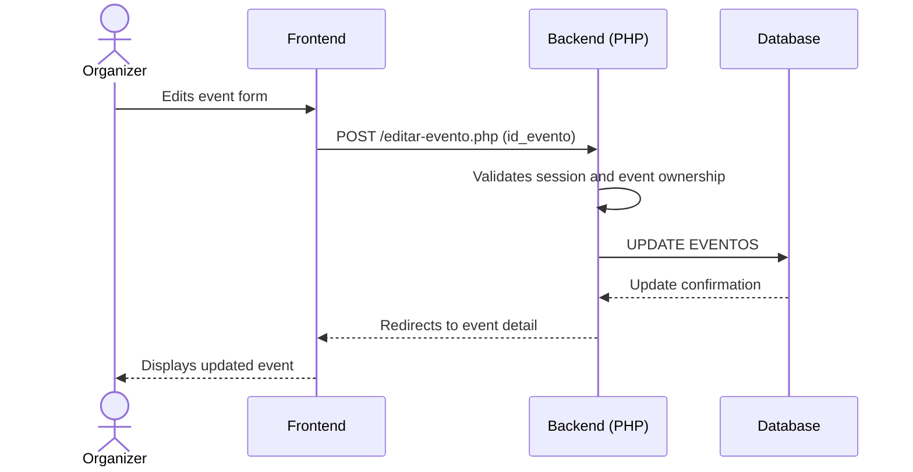
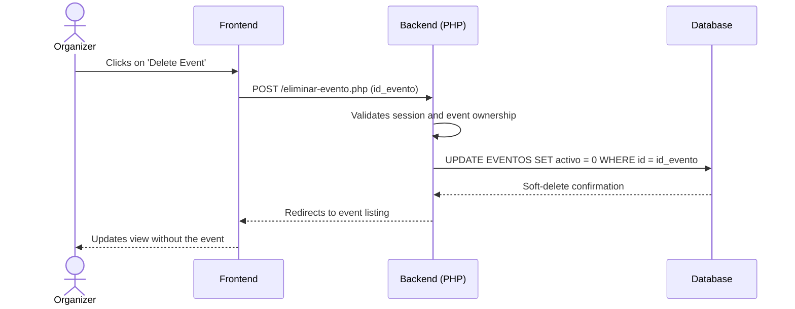
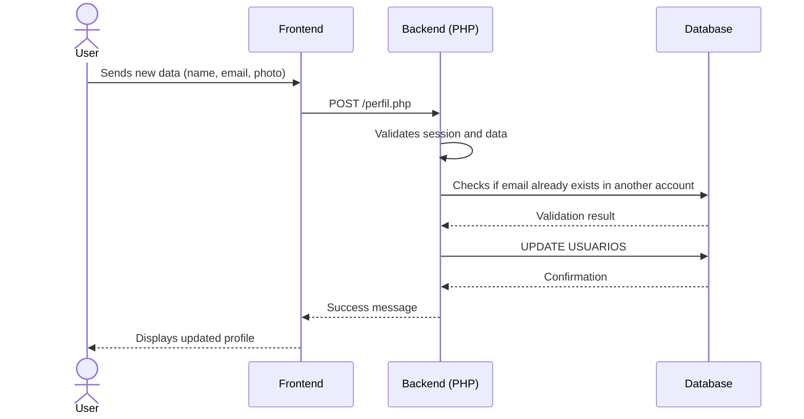
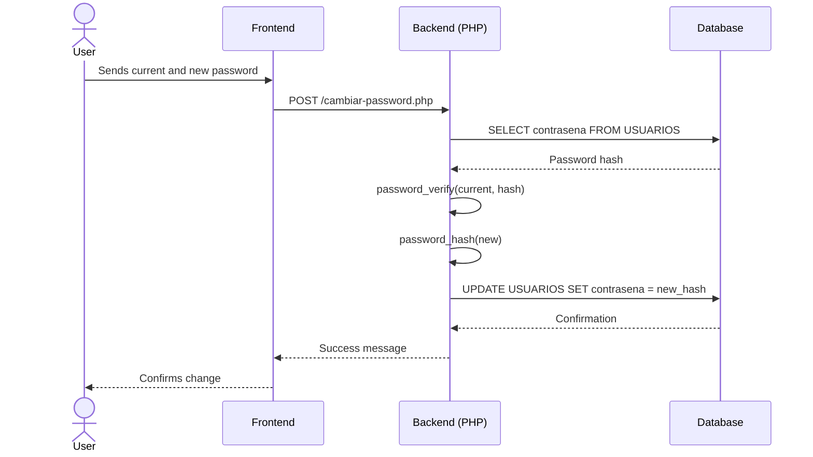
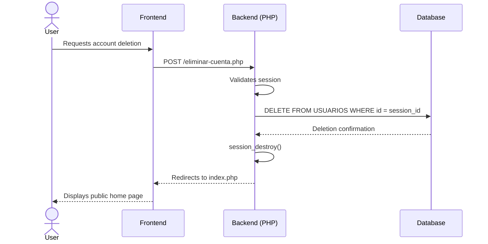

<div align="center">


# Run &amp; Eat

**Urban Gastronomic Events Platform**

[](https://www.php.net/)
[](https://www.mysql.com/)
[](#)
[](#)
[](#)
[](#)


---


</div>

## Table of Contents

- [Description](#-description)
- [Tech Stack](#-tech-stack)
- [Features](#-features)
- [User Roles](#-user-roles)

---

## Description

**Run & Eat** is a web platform specialized in publishing and managing urban gastronomic events. It connects culinary experience organizers with participants looking to discover local gastronomy in an active and social way: fun runs, wine tastings, burger runs, tapas routes, and much more.

The project was developed entirely as an academic project for the **Web Application Development (DAW)** course at Stucom, Barcelona, using standard web technologies without external frameworks.

| Feature | Detail |
|---|---|
| Type | Event web platform |
| Main City | Barcelona, Spain |
| Roles | Client · Organizer · Admin |
| Authentication | Native PHP Sessions |
| No external dependencies | Native PHP + MySQL |

---

## Tech Stack

| Layer | Technology |
|---|---|
| Backend | PHP 8.0+ (native, no frameworks) |
| Database | MySQL 8.0 — PDO with prepared statements |
| Frontend | HTML5 + CSS3 + JavaScript ES6 |
| Server | Apache (XAMPP recommended for local) |
| Version Control | Git |
| File Uploads | PHP `finfo` + `move_uploaded_file()` |

---


## Features

### Authentication

| Action | Description | File |
|---|---|---|
| Register | Field validation, email format, password matching, user type, and DB duplicates | `UserController.php` |
| Login | Credential check against DB and session writing | `UserController.php` |
| Logout | Full session destruction with `session_unset()` + `session_destroy()` | `UserController.php` |
| Guard | Middleware that protects routes by role; redirects to forbidden if not authorized | `auth_guard.php` |

### User Profile

| Action | Description |
|---|---|
| Edit info | Update name and email with validation for duplicated email in another account |
| Change password | Current password verification before applying changes; minimum 8 characters |
| Profile photo | Upload with real MIME validation (`finfo`), allowed extension, and 2 MB limit |
| My events | List of registered events using `JOIN` with the `INSCRIPCIONES` table |

### Events

| Action | Role | Description |
|---|---|---|
| List events | All | Main page with pagination and city search |
| View detail | All | Full info, integrated Google Maps map, registration button |
| Create event | Organizer | Form with image, level, cuisine type, price, capacity, and distance |
| Register | Client | Full transaction flow: validates availability, prevents duplicates, decrements spots; redirects to login if unauthenticated |

### User Interface

The platform prioritizes a smooth and interactive user experience. **Both events and organizers are displayed using a dynamic carousel managed by the jQuery Slick plugin**. This implementation significantly improves navigation, allowing touch sliding on mobile and visual controls on desktop, optimizing the visual presentation of content.

#### Color Palette
The visual identity of **Run & Eat** uses an elegant dark mode with vibrant accents:

- 🟠 `#FFA208` — **Vibrant Orange**: Main accent color (buttons, links, stars, icons).
- 🌑 `#0A192F` — **Deep Navy Blue**: Main background color.
- 🌒 `#112240` — **Light Navy Blue**: Background color for cards, headers, and menus.
- ⚪ `#FFFFFF` — **White**: Main text.
- 🔘 `#233554` — **Grayish Blue**: Borders, dividers, and secondary elements.

---

## Sequence Diagrams

Below are the main interaction flows of the application to better understand the communication between the client, the server, and the database.

### 1. Event Management

#### View Event Detail (Read)


#### Create Event


#### Modify Event


#### Delete Event


### 2. User Management

#### Modify Profile


#### Change Password


#### Delete User


---

## User Roles

Access to different sections is managed through `auth_guard.php` using three main functions:

```php
auth_require_login();           // Requires active session
auth_require_role("organizador"); // Requires specific role
auth_is("organizador");         // Returns bool — conditional use in views
auth_check();                   // Checks if there is an active session
```

| Permission | `client` | `organizer` | `admin` |
|---|---|---|---|
| View event listing | ✅ | ✅ | ✅ |
| View event detail | ✅ | ✅ | ✅ |
| Register for event | ✅ | ✅ | ✅ |
| Manage profile | ✅ | ✅ | ✅ |
| Create events | ❌ | ✅ | ✅ |
| "Create event" button in nav | ❌ | ✅ | ✅ |
| Edit / Delete any event | ❌ | ✅\* | ✅ |

If a user with a `client` role tries to access a route protected by `organizer`, `auth_guard.php` renders a **restricted access** page instead of redirecting, showing the user's name and a link to the contact form.

---

### Tables

| Table | Description | Key Fields |
|---|---|---|
| `USUARIOS` | Registry of all users | `id_usuario`, `nombre_completo`, `email`, `contrasena`, `tipo_usuario`, `foto_perfil`, `fecha_registro`, `activo` |
| `EVENTOS` | Events published by organizers | `id_evento`, `id_organizador`, `titulo`, `descripcion`, `fecha`, `hora`, `ciudad`, `direccion`, `precio`, `participantes`, `nivel`, `tipo` |
| `INSCRIPCIONES` | N:M relationship between users and events | `id_usuario`, `id_evento` |
| `VALORACIONES` | User reviews on attended events | `id_valoracion`, `id_usuario`, `id_evento`, `puntuacion`, `comentario` |
| `FAVORITOS` | Events saved by users | `id_usuario`, `id_evento` |

---

</div>

<br><br>
<hr>
